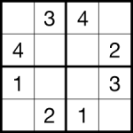

# sudoku-prolog

# Sudoku en Prolog

1.1. Práctica de lógica computacional
=================
Hay muchas variantes de sudoku, el sudoku de 4 x 4 es uno de ellos y será el problema que se resuelve en la siguiente práctica.
Este sudoku es una cuadrícula de 4 x 4 celdas (16 casillas) compuesto por cuatro filas, cuatro columnas y dividida en cuatro
subcuadrículas (bloques) de 2 x 2. 

### Objetivo del juego
Dado un array de 4×4 parcialmente lleno, el objetivo es asignar dígitos de 1 a 4 a las celdas vacías, 
para que cada fila, columna y subcuadrícula contenga exactamente una instancia de los dígitos de 1 a 4 
sin repetición. 
- Metodología normal para resolver: mediante el proceso de eliminación. Para encontrar las combinaciones 4x4 válidas examina la posición del
 número en otras columnas, filas y subcuadrículas para saber en qué columnas, filas y bloques no puede incluirse de nuevo este número (sin repetirse).
 ---

## 1.	Cargar programa en prolog
-Para cargar el programa hay que darle doble click al fuente .pl en el administrador de archivos o similar (p.ej. windows commander), abre el SWI-prolog y carga el programa. 

-Otra manera rápida de hacerlo es abrir SWI-prolog, y después File -> Consult.

## 2.	Ejecución del programa 
Para ejecutar el programa, haremos lo siguiente: 

Para ejecutar el programa hay que llamar al predicado sudoku(). Se mete entre corchetes '[]' la lista
con los números del sudoku en orden de izquierda a derecha empezando por la celda 1 x 1. Los espacios en blanco se llaman utilizando un guión bajo, '_'.

Utilizando el sudoku de la imagen anterior como referencia, aquí tienes un ejemplo:

sudoku([_, 3, 4, _,
	    4, _, _, 2,
        1, _, _, 3,
	    _, 2, 1, _]).
		
---

1.2. Reglas del sistema
==========

### Reglas del sistema en lenguaje natural

A modo de un sudoku 4 x 4 se desarrolla un sistema para devolver la cuadrícula rellenada con números válidos, a partir 
de una cuadrícula incompleta que se acepta como una lista 'Lista1'. 

Un conjunto de reglas se muestra a continuación:

a)	Verificar Rango de la Lista1: para todo elemento de Lista1 debe estar en el rango de 1 a 4. 
b)	Lista1: si existen elementos no instanciados en Lista1 asignar un número del 1 a 4. 
c)	Verificar Fila: comprobación para toda fila n, si todos los elementos son diferentes. Si no son diferentes, volver a regla b) y probar con otra rama.  
d)	Verificar columna: análogo al paso anterior pero comprobar para toda columna
e)	Verificar bloque: análogo al paso anterior pero comprobar para todo bloque
f)	Secuenciación correcta: no se da el caso que quede ningún número repetido dentro de una fila, columna y bloque. 
---

1.3 Fases de ejecución en Prolog
==========
Codificado de reglas anteriores

## - sudoku()

~~~
sudoku(L) :-
	range(L), 
	filas(L), 
	cols(L), 
	bloques(L),
	print_sudoku(L).
~~~

Es la función principal que reúne todas las posibles comprobaciones que hará el programa para resolver el sudoku. 
Al llamar al predicado sudoku(), este recibe una lista que corresponde a la tabla de sudoku 4 x 4 que queremos resolver. Se encarga de verificar si las variables
tienen valores asignados en el rango y despues verifica que las filas, columnas y bloques tienen números válidos sin repetición.  

Al terminar la validación llama a un predicado para imprimir el resultado por pantalla. 

---
## - range()
~~~
rango(X):-
	nonvar(X), 
	X > 0,	
	X =< 4.
rango(X):- 
	var(X),	
	num(X). 	
num(1).
num(2).
num(3).
num(4).
~~~
	
El primer predicado que llama la función sudoku() es el range(). Verifica que el elemento cabeza de la lista está en el rango, pasándole el elemento
al predicado rango() y entonces hace un llamado recursivo con el resto de elementos. Al quedarse la lista vacia terminará la recursividad.

El predicado rango verifica si está instanciado la variable con 'nonvar(X)', y luego comprueba si el valor de la variable está entre 1 y 4.
Si no está instanciado falla la condición y pasa a la siguiente. Este verifica si no está instanciada y le asigna un valor a la variable con uno de los números válidos 'num(X)'. 
 
--- 
## - diff() 

~~~
diff(L):-
	length(L, N), 
	sort(L, L1), 
	!, 
	length(L1, N). 
~~~ 

El predicado diff() asigna la longitud de la lista de elementos a una variable N. Utiliza un sort que devolverá la lista ordenada eliminando valores repetidos y la asigna a la variable L1.
A continuación verifica si longitud de L1 es igual a N. En el caso que no lo sea, hace backtrack y debido al corte aborta el predicado. Al fallar el camino continua haciendo backtrack,
vuelve a condición anterior 'rango()' donde encuentra otra rama para probar y hace otra asignación.  

---

## - filas()

~~~
filas([A,B,C,D,E,F,G,H,I,J,K,L,M,N,O,P]) :- 
	diff([A,B,C,D]),
	diff([E,F,G,H]),
	diff([I,J,K,L]),
	diff([M,N,O,P]).
~~~
 
El predicado recoge la lista de valores y las asigna a variables de A-P. Comprueba que en cada una de las 4 filas, los elementos son diferentes y por lo tanto válidos. 
Los predicados de cols() y bloques() funcionan de forma análoga pero comparando sus espacios correspondientes. 

---

## - print_sudoku()

~~~
print_sudoku([C1,C2,C3,C4|R]):- 
	write(C1), write('  '),
	write(C2), write('  '),
	write(C3), write('  '),
	write(C4), nl,
	print_sudoku(R).
~~~

Formatea resultado de sudoku final por pantalla. Recoge los 4 elementos iniciales de la lista y los devuelve por pantalla con los espacios y saltos de línea correspondientes. 
Al terminar llama de nuevo al predicado print_sudoku() y cuando lista se queda vacía se termina la recursividad. 

---
 